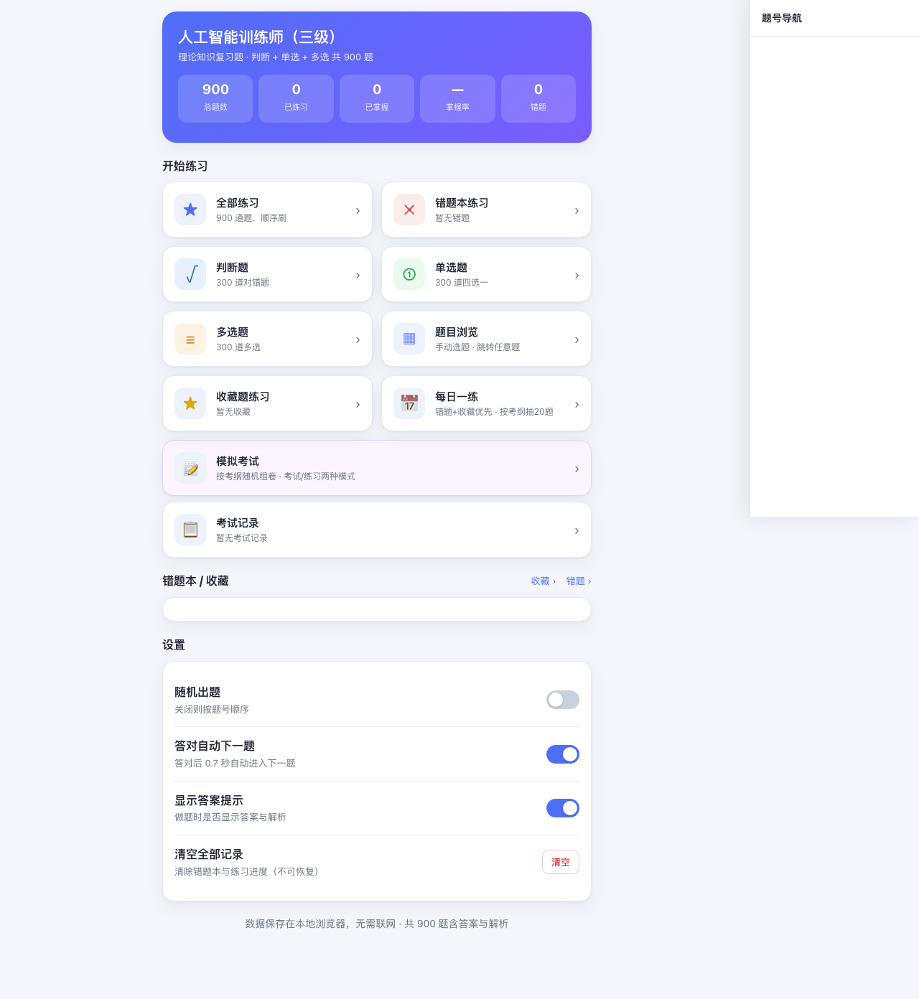
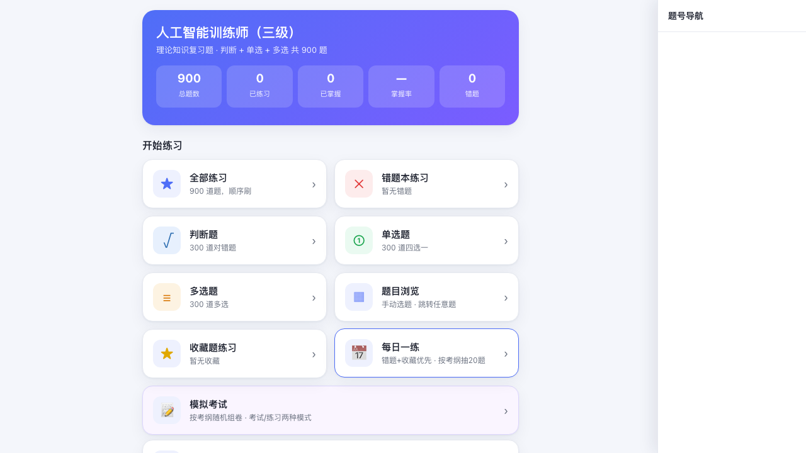
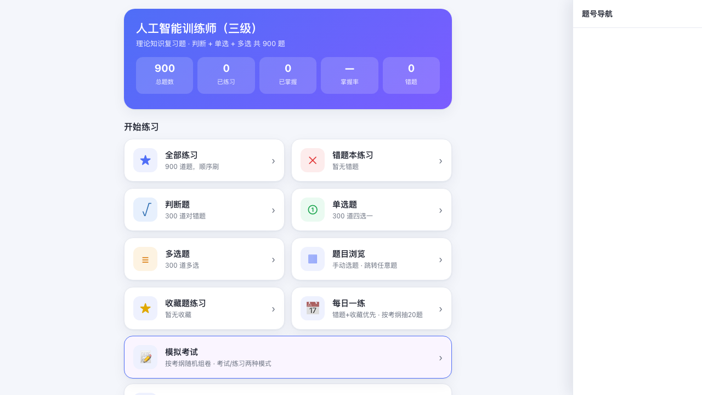
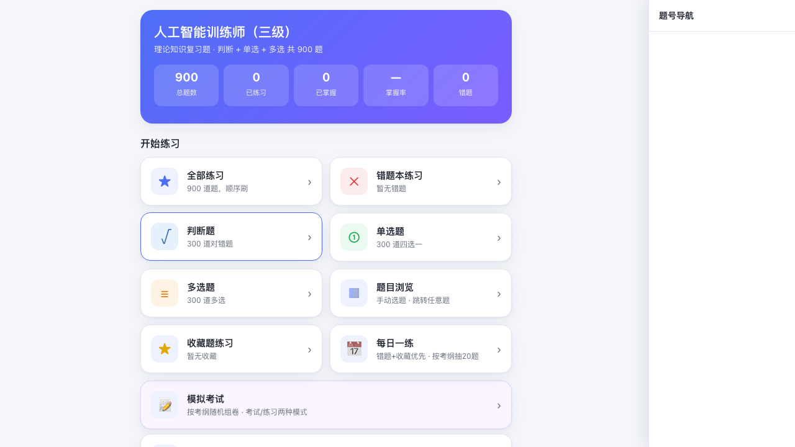
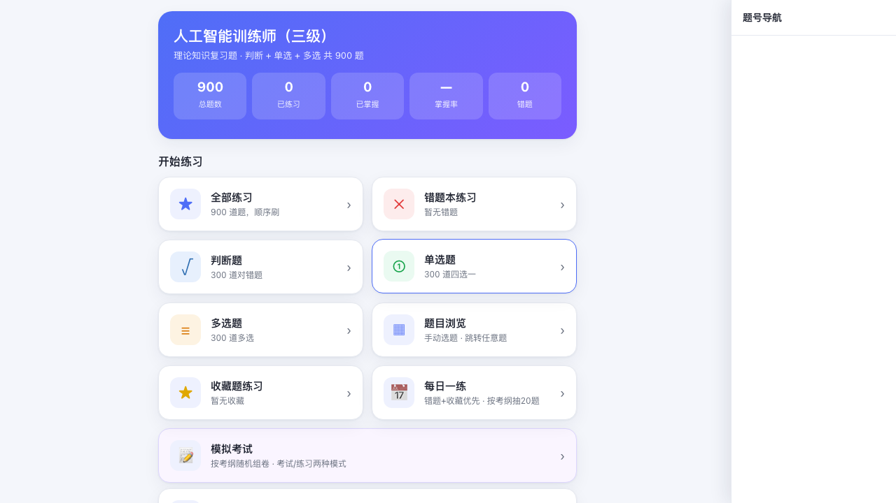
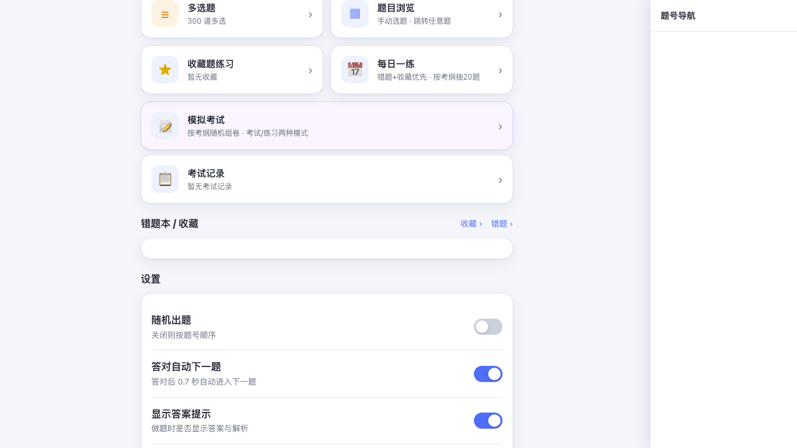

# 人工智能训练师（三级）· 理论刷题应用

> 🚀 **在线体验**: https://ai-quiz3-app.pages.dev/
>
> 📦 **GitHub 仓库**: https://github.com/GlennZhang/ai-quiz3-app

基于 `第3部分-人工智能训练师_3级_理论知识复习题.docx` 制作，共 **900 题**（判断题 300 + 单选题 300 + 多选题 300），**每题均含正确答案与解析**。

## 使用方法

**双击打开 `index.html` 即可**（推荐用 Chrome / Edge / Safari）。无需联网、无需安装，所有数据内置在文件中。

> `index.html` 是自包含的（题目数据已嵌入），单独拷贝这一个文件就能用。`questions.json` 是结构化数据源，可作为备份/二次编辑用。

## 界面预览

### 首页 - 所有功能一览

### 每日一练 - 智能组卷

按考纲随机抽取20题，优先错题和收藏题，帮助巩固薄弱知识点。

### 模拟考试 - 真实考场体验

按考纲自动组卷，支持考试模式（计时、交卷批改）和练习模式（即时反馈）。

### 练习界面 - 清晰易用

支持快捷键答题，自动保存进度，即时显示答案和解析。

### 错题本 - 重点突破

记录每道错题的做错次数，按次数排序，支持单题查看/移除/清空。

## 功能

| 功能 | 说明 |
|------|------|
| **全部练习** | 900 题顺序/随机刷 |
| **📝 模拟考试** | 按考纲自动组卷：判断/单选/多选各自题量 + 6 大知识点比例（职业道德/基础知识/业务分析/智能训练/智能系统设计/培训与指导），随机抽题、优先未做的。两种模式：**考试模式**（计时、可跳题、交卷后统一批改，出得分/各题型/各知识点正确率/错题解析）与 **练习模式**（即时反馈）。题量、分值、知识点比例、时长均可自定义 |
| **📋 考试记录** | 每次交卷自动存档（最多 30 次）。首页「考试记录」可查看历次列表（时间/分数/题数/用时 + 次数/平均/最高统计），点开任意一次看详情：得分、各题型与知识点正确率、**每道题你的选项 vs 正确答案 + 对错**，点「解析」看完整解析 |
| **题型专项** | 判断题 / 单选题 / 多选题 分别练习 |
| **错题本练习** | 只刷做错的题，直到全部掌握（答对自动移出错题本）|
| **错题本** | 记录每道错题的**做错次数**，按次数排序，可单题查看/移除/清空 |
| **收藏** | 做题时点 ★ 收藏任意题；首页「收藏题练习」专门刷收藏题；首页「收藏 ›」进收藏本查看/移除/清空（按收藏时间排序）|
| **题目浏览 / 手动选题** | 题号网格，绿=已答对、红=错题、灰=未练；点任意题号直接跳转 |
| **侧边题号导航** | 做题时点右上「题号 ▤」打开侧栏，实时显示**本轮**所有题号（绿=对/红=错/白=未做），点题号快速跳转、随时回看 |
| **点击回看** | 点已答题号 → 显示解析 + 回显你的选择（错→你的选项红、正确答案绿；对→正确答案绿），并锁定 |
| **重新做** | 做题界面「重新做」按钮，清空**本轮**作答、回到第 1 题（不影响错题本）|
| **进度继续 / 重新** | 点「全部练习/题型专项」时，若该模式有未完成进度，弹窗让你选：**继续**（从第一个未做的题开始，前面已做的可在题号导航回看）或 **重新**（从第 1 题）。基于全局答题记录，不会丢进度 |
| **首页进度** | 每个模式卡片显示「已做 X / 总数 · 剩余 N」，一眼看到刷题进度 |
| **继续上次** | 中途退出后，首页出现「继续 · …」卡片，精确恢复上次本轮的位置与作答状态 |
| **即时反馈** | 答错**立即**显示正确答案 + 解析；答对后自动进入下一题（可在设置关闭）|
| **本地保存** | 进度、错题本、设置、本轮进度全部存在浏览器本地，关掉再开继续 |

## AI 助教

右下角 💬 浮动按钮，可基于你的错题与进度生成错题总结、讲解题目。AI 回复支持 Markdown 渲染，思考过程可折叠，对话框可拖拉调整大小。

### 使用方法

1. 点面板顶部 ⚙ → 填写 **Base URL**、**API Key**、**模型名**（也可选预设：DeepSeek / 智谱 GLM / Ollama 本地 / 自定义，一键填充）。
2. 在输入框提问，或点「总结错题 / 分析薄弱点」快捷指令。
3. 助教按需调用工具（`get_wrong_questions` / `get_question` / `get_progress_stats` / `search_questions`）只读你的学习数据后再作答。

### 🔒 数据与密钥安全（重要）

- 你填的 **Base URL、API Key、模型名只保存在你本机浏览器的 `localStorage`**——不会上传到本应用仓库、不会发给本应用作者、不会发到任何第三方。
- 这些配置**仅在你发起提问时**，由浏览器直接请求**你自己配置的 LLM 服务地址**（作为标准 `Authorization` 请求头），全程点对点。
- 助教通过工具调用**只读**答题数据，绝不修改错题 / 进度 / 设置。
- 想完全离线：选 Ollama 预设，本地 `ollama serve`，无需 Key、无需联网。

### 注意

- 部分厂商（如 Anthropic）不允许网页直接调用（CORS）；首选支持浏览器直连的 DeepSeek / Ollama，或自建代理。
- 部署时 `ai-tutor.js` 需与 `index.html` / `mock/index.html` 一起上传。

## 设置项

- **随机出题**：开启后题序打乱
- **答对自动下一题**：答对 0.7 秒后自动跳下一题（答错不自动跳，方便看解析）
- **显示答案提示**：做题时是否显示解析

## 快捷键（做题时）

- 判断题：`1`=对 / `2`=错（或 `Y`/`N`、↑/↓）
- 单选题：`A` `B` `C` `D`
- 多选题：`A`–`E` 多选，`Enter` 提交
- 已作答：`Enter` / `→` / 空格 → 下一题

## 数据说明

- 题目原文与选项严格取自 docx，未改动。
- 答案与解析为基于人工智能训练师领域知识作答，已做格式与一致性校验；个别边界题（多为工具/软件版本相关的描述题）已尽量贴合教材口径，如发现存疑可在做题界面对照解析判断。
